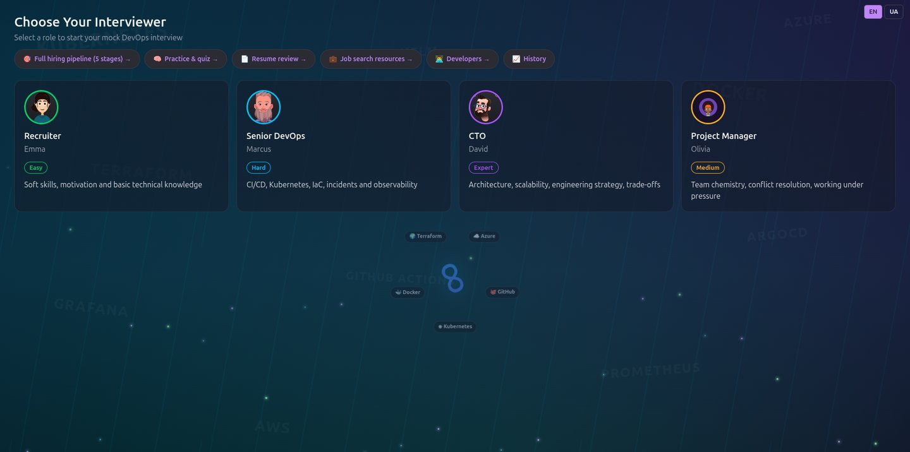
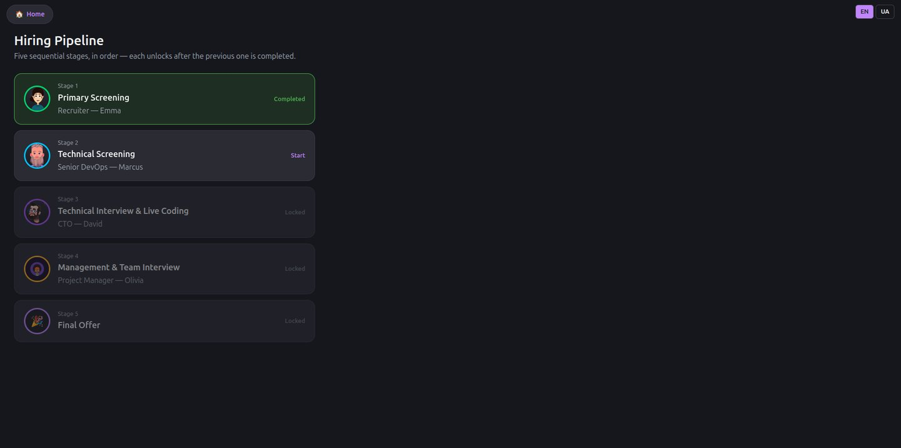
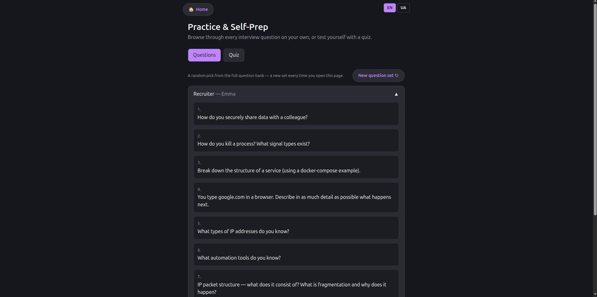
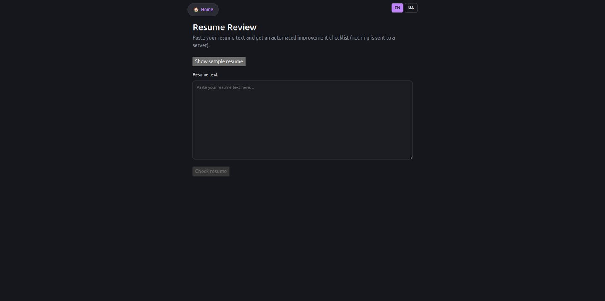
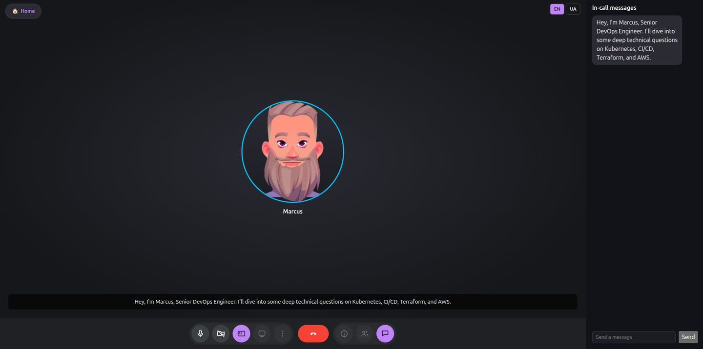

# devops-interview-web

Web version of **[DevOps Interview AI](https://github.com/AI-DevOps-Interview-Avatar/devops-interview-ai)** — mock DevOps job interviews right in the browser, no backend required. Counterpart to the Android ([devops-interview-ai](https://github.com/AI-DevOps-Interview-Avatar/devops-interview-ai)) and iOS/macOS ([devops-interview-apple](https://github.com/AI-DevOps-Interview-Avatar/devops-interview-apple)) apps, deployed as a static site on GitHub Pages.

---

## Screenshots

| Choose Your Interviewer | Full Hiring Pipeline (5 stages) |
|---|---|
|  |  |

| Practice & Self-Prep | Resume Review | Meet-style Interview Session |
|---|---|---|
|  |  |  |

---

## What it does

- **Full 5-stage hiring pipeline** — Recruiter (Emma) → Senior DevOps (Marcus) → CTO (David) → Project Manager (Olivia) → Final Offer, each stage unlocking after the previous one is completed
- **Practice & Self-Prep hub** — browse the full interview question bank per persona, or self-test with a quiz (randomized set on every visit)
- **Resume Review** — paste resume text and get an automated improvement checklist, entirely client-side (nothing is sent to a server)
- **Job search resources** — curated sites, Telegram channels, and tips for finding DevOps roles
- **Meet-style call UI** — the AI interviewer sits in a video-call tile (Rive avatar, live captions), your camera preview in the corner, in-call chat panel for typed answers
- **Voice input/output** — Web Speech API for speech-to-text answers, SpeechSynthesis TTS for the interviewer, with continuous-listening recovery so answers don't get cut off mid-thought
- **EN/UA language switcher** — every screen, English by default
- **History** — past sessions persisted in `localStorage`

All inference and state stay in the browser — no backend server, no API keys, no account.

## Architecture

Just like the mobile apps, all inference runs on the client — no backend server, no API keys. GitHub Pages only serves static files, so LLM inference runs directly in the browser via WebAssembly/WebGPU (MediaPipe LLM Inference Web API) — tracked in epic **[DIA-84](https://devops-interview-ai.atlassian.net/browse/DIA-84)**. Until that lands, a canned `MockLlmBackend` drives interview responses — the same approach as `MockLLMBackend` in `devops-interview-apple` — so the full pipeline/practice/resume/voice UX above works end-to-end today without waiting on the real on-device model.

## Tech Stack

| Layer | Technology |
|---|---|
| Language | TypeScript |
| UI | React 19 |
| Routing | React Router (basename under GitHub Pages) |
| State | Redux Toolkit |
| Avatars | Rive Web Runtime (`@rive-app/react-canvas`) |
| Voice | Web Speech API (SpeechRecognition + SpeechSynthesis) |
| i18n | i18next / react-i18next (English default, Ukrainian switch) |
| Build | Vite |
| Hosting | GitHub Pages (deployed via GitHub Actions) |

## Project Structure

```
src/
├── domain/models/     — domain models (InterviewerProfile)
├── api/                — LLM client (MockLlmBackend, later MediaPipe Web)
├── store/              — Redux Toolkit slices + localStorage history
├── i18n.ts            — i18next setup (default "en", switchable to "ua")
├── shared/ui/          — AvatarTile (Rive), LanguageSwitcher, Home button
└── pages/
    ├── splash/                 — model bootstrap / loading screen
    ├── interviewer-selection/  — interviewer persona picker
    ├── pipeline/               — 5-stage hiring pipeline flow
    ├── practice/               — question bank + quiz
    ├── resume-review/          — resume checklist
    ├── resources/              — job search resources
    ├── developers/             — team / project info
    ├── meet-session/           — Meet-style session with chat
    └── history/                — past session history

public/
├── avatars/    — .riv character rigs (shared with devops-interview-apple)
└── locales/    — en/ and ua/ translation.json
```

## Run locally

```bash
npm install
npm run dev
```

## Build & Lint

```bash
npm run build   # tsc -b && vite build
npm run lint     # eslint .
npm run test     # vitest run
```

## Deployment

Pushing to `main` automatically builds and publishes the site via `.github/workflows/deploy-pages.yml` (GitHub Actions → GitHub Pages). The base path is fixed in `vite.config.ts` (`/devops-interview-web/`), and the SPA fallback is a copy of `index.html` written to `404.html` during the build step.

## Localization

The UI defaults to English regardless of browser locale; a switcher (top-right on every screen) toggles to Ukrainian. Translation strings live in `public/locales/{en,ua}/translation.json`. Documentation in this repository is maintained in English going forward.

## Avatars

The four `.riv` character rigs in `public/avatars/` are shared with `devops-interview-apple`, each driven by a state machine named `State Machine 1` with a boolean `speak` input. Three of the four are free community rigs licensed **CC BY 4.0** — attribution is required if this app or its assets are redistributed:

- Senior DevOps: "Character face animation" by ak2665622 ([rive.app/community/files/4532-9211](https://rive.app/community/files/4532-9211))
- Recruiter (Emma): "Avatar" by vsherr842 ([rive.app/marketplace/4654-9410-avatar](https://rive.app/marketplace/4654-9410-avatar))
- HR (Olivia): "My Avatar" by JcToon ([rive.app/community/files/554-1038-my-avatar](https://rive.app/community/files/554-1038-my-avatar))
- CTO (David): "Interactive Avatar" by JoeyJudkins ([rive.app/community/files/9294-17679-interactive-avatar](https://rive.app/community/files/9294-17679-interactive-avatar))

Only the Senior DevOps rig was authored with a real `speak` input; the other three are portfolio pieces built for hover/pointer interaction rather than TTS-driven talking, so their idle frame may render mostly static until a proper per-role rig replaces them.

## Backlog

Real on-device LLM inference (replacing `MockLlmBackend` with the MediaPipe LLM Inference Web API) is tracked in epic **[DIA-84](https://devops-interview-ai.atlassian.net/browse/DIA-84)**. The full task history for this app lives in the **DIA** Jira project, epics `DIA-83`–`DIA-136`.

## License

Inherits the **Business Source License 1.1** from the main project — see [LICENSE](https://github.com/AI-DevOps-Interview-Avatar/devops-interview-ai/blob/main/LICENSE) in `devops-interview-ai`.
